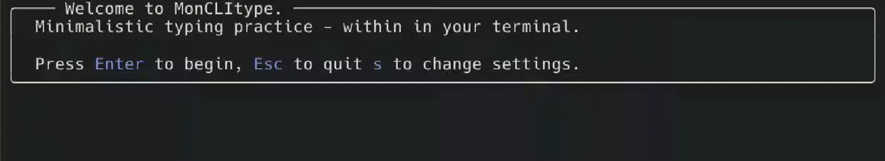

# MONCLITYPE
### Even more minimalistic version of monkeytype, offline and within the terminal. 

#### Features:
- Endless typing practice
- Lean performance review
- Several difficulty settings
- occasionally niche & unhinged vocabulary

#### Trashy GIF demo

#### Usage:
- clone
- chmod +x monclitype.jl
- ./monclitype.jl

#### Prerequisites:
- Julia >1.0

#### TODOs
- simplify distribution
- optimize startup
- add persistent settings
- blinking cursor
- customizability (more wordlists, user exposed style, ...)
- more gamemodes

